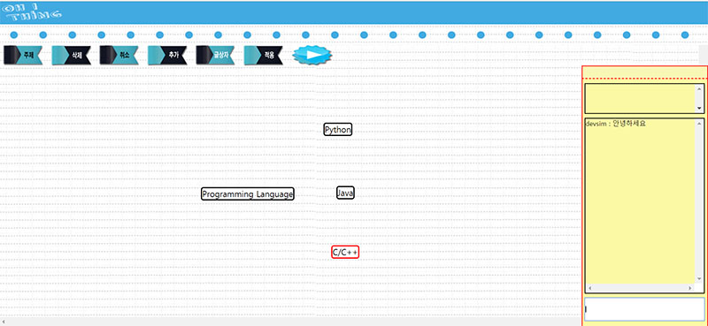

Oh!Thing (마인드맵과 채팅을 이용한 실시간 협업 서비스)

2014.09.10 제작
사용 기술 :

Front-end - HTML, CSS, JAVASCRIPT, JQUERY, AJAX

back-end - flask(Python)

실시간 소켓 통신 - Pusher

GAE(Google App Engine)에 배포.

Demo : http://ohthing-220617.appspot.com/

사용법
닉네임과 RoomId를 입력한다.
RommId가 같은 사람들끼리만 협업이 가능하다.

오른쪽 대화창을 통해 실시간으로 채팅을주고 받을 수 있다.

'주제'를 클릭하면 새 노드가 생성된다.
드래그를 사용하여 적절히 배치한다.

상자를 클릭한다. (포커싱이 되면 테두리가 붉게 변한다.)
'글상자'를 누르면 텍스트 입력이 가능한다.
글 작성 후 적용을 누르면 입력을 마칠 수 있다.

'추가'를 눌러 자식 노드를 생성할 수 있다.

#### 미완성 버전입니다.
노드간의 연결선이 없다...   
